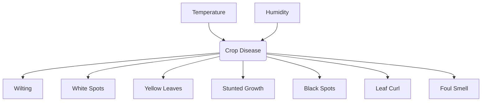

# Agriculture Disease Finder — AI Crop Diagnosis 🌾🔬

An interactive AI-powered application that diagnoses crop diseases using a **Bayesian Network** model. By evaluating environmental context (Temperature, Humidity) and key symptoms (Wilting, Yellow Leaves, White Spots, etc.), the system estimates the probabilities of various plant conditions and provides actionable remedies.

---

## 🌟 Key Features

* **Probabilistic Diagnosis:** Utilizes a Bayesian Network (via `pgmpy`) to handle uncertainty and calculate exact marginal probabilities of diseases.
* **Environmental Context:** Includes temperature and humidity factors to enhance prediction accuracy (e.g., high humidity increases Downy Mildew probability).
* **Multi-Symptom Analyzer:** Evaluates 7 symptoms (Wilting, White Spots, Yellow Leaves, Stunted Growth, Black Spots, Leaf Curl, Foul Smell) across 3 severity levels (`None`, `Mild`, `Severe`).
* **Interactive Frontend:** Built with React, Vite, and modern styling, offering an intuitive dashboard to toggle symptoms and view real-time results.
* **Actionable Treatment Tips:** Returns custom treatment recommendations, severity indicators, and descriptions for diagnosed diseases.

---

## 🏗️ Architecture & Model Design

The system is designed as a **Discrete Bayesian Network** with the following dependency structure:



### Supported Diseases
* **Healthy** (🟢)
* **Powdery Mildew** (🟡)
* **Root Rot** (🔴)
* **Leaf Blight** (🟠)
* **Bacterial Wilt** (🟣)
* **Downy Mildew** (🔵)
* **Mosaic Virus** (🌐)

---

## 📂 Project Structure

```text
├── backend.py            # FastAPI Application & Bayesian Network Model
├── requirements.txt      # Python Dependencies
├── .gitignore            # Git Ignore Rules
└── frontend/             # React + Vite Frontend Application
    ├── package.json      # Node.js dependencies
    ├── index.html        # App entry page
    └── src/
        ├── App.jsx       # Main Dashboard UI & Logic
        ├── main.jsx      # React entrypoint
        └── index.css     # CSS Styling & Theme Tokens
```

---

## ⚙️ Getting Started

### Prerequisites
* Python 3.10+
* Node.js 18+ & npm

### 🔌 Running the Backend

1. **Create and Activate a Virtual Environment:**
   ```bash
   python -m venv .venv
   # On Windows:
   .venv\Scripts\activate
   # On macOS/Linux:
   source .venv/bin/activate
   ```

2. **Install Dependencies:**
   ```bash
   pip install -r requirements.txt
   ```

3. **Start the FastAPI Server:**
   ```bash
   python backend.py
   # Or run manually: uvicorn backend:app --reload --port 8000
   ```
   The backend API will run at `http://localhost:8000`.

---

### 🎨 Running the Frontend

1. **Navigate to the frontend directory:**
   ```bash
   cd frontend
   ```

2. **Install Dependencies:**
   ```bash
   npm install
   ```

3. **Start the Vite Development Server:**
   ```bash
   npm run dev
   ```
   Open `http://localhost:5173` in your browser to view the application.

---

## 🛠️ API Documentation

### `POST /predict`
Submit symptoms and environmental states to obtain disease probabilities.

**Request Body:**
```json
{
  "Temperature": "High",
  "Humidity": "High",
  "Wilting": "None",
  "WhiteSpots": "Severe",
  "YellowLeaves": "Mild",
  "StuntedGrowth": "None",
  "BlackSpots": "None",
  "LeafCurl": "None",
  "FoulSmell": "None"
}
```

**Response Sample:**
```json
{
  "prediction": "Powdery_Mildew",
  "probabilities": {
    "Healthy": 0.05,
    "Powdery_Mildew": 0.72,
    "Root_Rot": 0.02,
    ...
  },
  "info": {
    "emoji": "🟡",
    "color": "#FFC107",
    "description": "A fungal disease causing white powdery spots on leaf surfaces.",
    "tip": "Apply fungicide, improve air circulation, avoid overhead watering."
  }
}
```

---

## 📜 License
This project is licensed under the MIT License.
